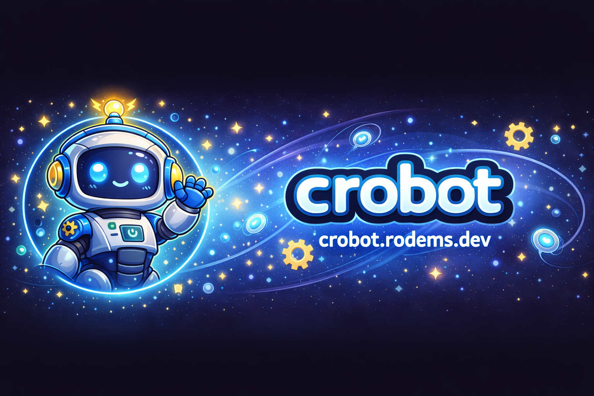

# Crobot

  

A modern Discord bot platform with AI-powered features, content aggregation, and subscription management. Built with a scalable microservices architecture and a beautiful web interface for configuration and management.

## Project Status

### Backend (.NET)

### Frontend (React)

## About

Crobot is a comprehensive Discord bot platform that combines AI-powered chat capabilities with intelligent content aggregation and distribution. The platform is designed for scalability, maintainability, and extensibility, featuring a microservices architecture that separates concerns across multiple specialized services.

### Key Features

- **AI-Powered Chat** - Interactive AI conversations with support for multiple AI providers
- **Content Aggregation** - Automated ingestion from Reddit, news APIs, and RSS feeds
- **Smart Content Routing** - Intelligent clustering and distribution of discovered content
- **Subscription Management** - Tiered subscription system with feature gating
- **Multi-Guild Support** - Scalable architecture supporting multiple Discord servers
- **Web Dashboard** - Modern React-based interface for bot configuration and user management
- **OAuth Integration** - Seamless authentication via Discord and Patreon OAuth2

## Architecture

Crobot follows a microservices architecture with clear separation of concerns:

- **Gateway Service** - Discord bot gateway handling interactions, commands, and sharding
- **Worker Services** - Background processing for content ingestion, routing, and posting
- **API Services** - RESTful APIs for operational monitoring and web backend
- **Web Frontend** - React SPA for user-facing configuration and management
- **Core Domain** - Pure domain models with zero dependencies
- **Infrastructure** - Data access, repositories, and external integrations

## Technology Stack

### Backend
- **.NET 10.0** - Modern C# runtime and framework
- **Discord.NET** - Discord bot framework with sharding support
- **Entity Framework Core** - ORM with PostgreSQL database
- **Serilog** - Structured logging and observability
- **Docker** - Containerization for all services
- **xUnit + NSubstitute** - Comprehensive testing framework

### Frontend
- **React 18** - Modern UI framework
- **TypeScript** - Type-safe development
- **Vite** - Fast build tool and dev server with bundle analysis
- **Material-UI (MUI)** - Professional component library
- **React Router** - Client-side routing
- **Axios** - HTTP client
- **Jest + React Testing Library** - Comprehensive testing with coverage tracking

### DevOps & Testing
- **GitHub Actions** - CI/CD pipelines with automated testing and deployment
- **Codecov** - Comprehensive code coverage with:
  - **Component Analysis** - Track coverage per service/module
  - **Flag Management** - Separate coverage tracking for backend/frontend
  - **Test Analytics** - Monitor test results and identify flaky tests
  - **Bundle Analysis** - Track JavaScript bundle size over time
- **Docker Compose** - Multi-service orchestration and local development
- **Netlify** - Frontend hosting with preview deployments
- **xUnit + Jest** - Unit and integration testing across all services

## Project Structure

This repository serves as the public-facing documentation and overview of the Crobot platform. The implementation is split across repositories:

- **[Backend](https://github.com/CoreyRo/crobot-backend)** - Microservices architecture (.NET), APIs, and Discord bot implementation
- **[Web](https://github.com/CoreyRo/crobot-web)** - React SPA for user management and configuration

## Quality & Testing

Both repositories maintain high code quality standards with:

- **Automated Testing** - Comprehensive unit and integration tests
- **Code Coverage Tracking** - Codecov integration with component-level analysis
- **Test Analytics** - Monitor test health and identify issues
- **Bundle Size Monitoring** - Track frontend bundle size and prevent regressions
- **CI/CD Pipelines** - Automated builds, tests, and deployments
- **Status Checks** - Coverage and test requirements on all pull requests

## License

See [LICENSE.md](LICENSE.md) for details.
